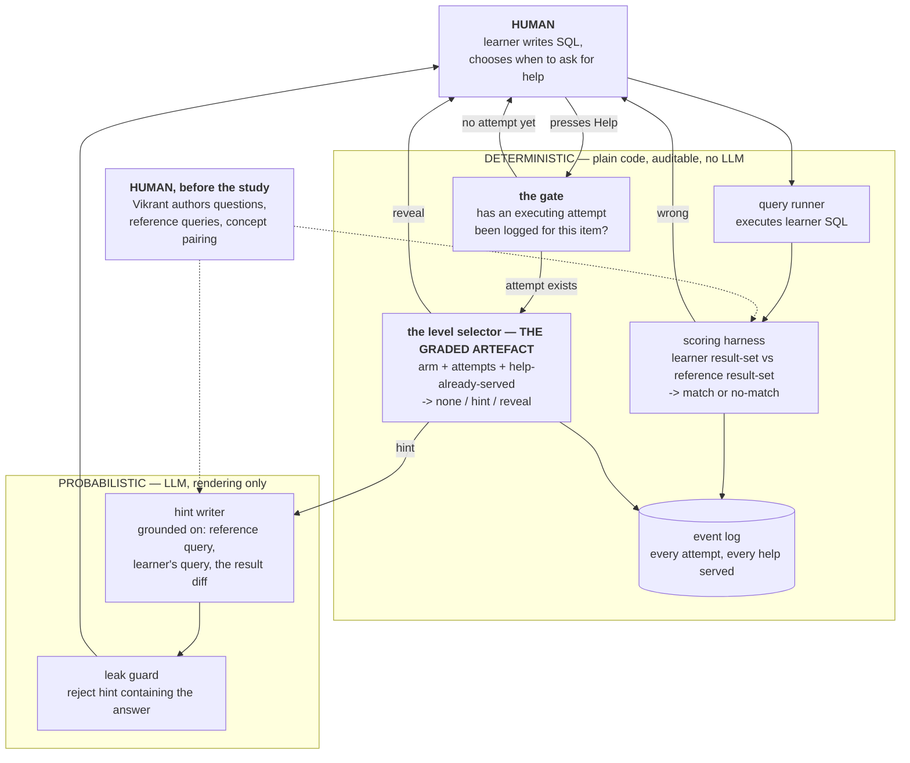

# Learning OS — PRD v1 (scope lock)

Written 10 Sep 2026. Supersedes `PRD-SEED.md`, which described a four-level ladder and a
competence estimator. Both are cut. This is the 6 Sep deliverable, late.

---

## 1. What I am building, in one paragraph

One web app. A learner reads a question in English, writes SQL in an editor, hits Run, and is
told right or wrong. When stuck, they press **Help**. The entire experiment is what Help
returns.

**Both arms use the same app.** Arm A must attempt before Help does anything, and the first
Help is a hint. Arm B gets the answer on demand. That is one boolean in a config. Everything
else — editor, runner, question set, correctness feedback, look and feel — is identical by
design, because if the environments differ I cannot attribute the result to the help policy.

## 2. The hypothesis

If the assistant withholds the answer until the learner has attempted, and gives a hint before
an answer, then unaided performance 5–7 days after the assistant is removed improves against an
answer-giving baseline.

**Mechanism.** Effortful retrieval builds storage strength faster per unit of help given.
Retrieval strength and storage strength are not a see-saw — nothing here *reduces* retrieval
strength; both conditions raise both, in different ratios.

**Narrowed claim (Bastani).** Their answer-giving arm scored *below* no-AI control; their
guardrailed arm merely matched control. My Arm B is their answer-giving arm. So a positive
result reads as **"withholding avoids the damage answer-giving does"**, not "withholding builds
skill." I am making the weaker claim on purpose. I cannot afford a third no-assistant arm at
n=6 and I am not pretending otherwise — see §7.

## 3. Architecture (rubric E3)

The one claim that matters: **the LLM is not in the control path.** It never decides whether to
help or how much. A deterministic policy decides; the LLM only renders the help text once that
decision is made.



**Why the split sits there.** The independent variable has to be under my control. If an LLM
judged "this learner seems stuck, give more," Arm A's treatment would vary unpredictably and I
could not state what Arm A received. Deterministic selection makes the manipulation auditable
from the log, which is the only way triage check 1 ("did the arms actually differ?") is
answerable at all. The LLM does the one thing code cannot: write prose about *this* learner's
specific mistake.

## 4. The policy, in full

```
on Help pressed for (learner, item):
    if arm == B:
        serve REVEAL                      # answer-giving baseline, no gate
    if arm == A:
        if no executing attempt logged for this item:
            refuse -> "give it one run first"      # THE GATE
        if help_served_for_item == 0:
            serve HINT
        else if attempts_since_hint >= N:
            serve REVEAL
        else:
            refuse -> "try once more with the hint"
```

That is the whole intervention — see below on what the treatment is and is not. `N` is fixed, not adaptive — the study tests withholding, not
adaptive withholding, and at 3 per arm a varying N would test two variables at once.

**Attempt counting.** An attempt counts if it executes AND its result set differs from the
previous attempt's. Syntax errors are logged as `attempt_type: syntax_error`, never blocked at
the UI — blocking there destroys the data that is itself the measurement. Help requests are
logged and never increment the counter.

### What the treatment actually is

Arm A differs from Arm B in **two** ways at once: the gate (must attempt before any help) and
the content of first help (hint, not answer). With three people per arm I cannot separate them —
that would need a third arm (gate + full answers) I cannot afford.

So the treatment is named as a **package**: *require an attempt, then give less than the answer.*
Both changes serve one mechanism — forcing the learner to generate rather than read — so this is
one construct implemented two ways, not two variables carelessly mixed. Bastani's GPT Tutor arm
differed from GPT Base in several ways at once and is reported as a single intervention for the
same reason.

**The limit, stated before anyone asks it:** a positive result supports the policy as a whole.
It does not establish that the gate specifically, or the hint specifically, is what worked. Any
write-up claiming component-level attribution is overclaiming.

**What partial attribution I can still get, for free.** The log records, per item, whether the
learner solved it after being refused help (the gate alone was enough) or only after reading a
hint. Correlational, not causal — but it is exactly the item-level evidence the arm averages
cannot carry at n=3.

**Correctness feedback is NOT withheld** from either arm (Koedinger). Both arms always learn
right/wrong. Only the *help* differs.

**"Unaided", operationally** (the brief's Q1, which it refuses to answer): an item is unaided
if the learner's first executing attempt was correct and no help was served on that item. A
help request marks the item assisted even if a later attempt is correct. This is the knowledge-
tracing definition and it is what the scoring script implements.

## 5. What is already built

The round-2 mini-screen (`screener/round-2-runbutton/sql-mini-screen.html`, 10 Sep) is the thin
vertical slice, minus the help path. It already has: SQLite in the browser, an editor, a Run
button, result-set comparison, error surfacing, per-attempt logging. That is most of §3's
deterministic column.

## 6. What is left to build — four items

1. **Help button + the policy in §4.** Plain code, ~40 lines. This is the graded artefact.
2. **Hint writer.** One LLM call, grounded on the reference query + the learner's query + the
   result diff. Plus the leak guard: reject any hint containing a runnable SELECT or the
   reference query's distinguishing clause. The leak guard is the 18 Sep evals deliverable.
3. **Log persistence.** Supabase table. If it threatens 20 Sep, fall back to the copy-log
   button already working in the mini-screen — 6 people pasting a blob is not the bottleneck.
4. **The question set.** Two concepts (GROUP BY/HAVING; two-table joins), practice items plus a
   concept-paired held-out set, frozen before the policy is written so I cannot tune to it.

## 7. Cut list — deliberately not built, and why

| cut | why |
|---|---|
| Competence estimator / BKT | Needs many observations per skill to converge. At n=6 with a short question set it is noise dressed as a model. Stays as a roadmap claim. |
| Four-level ladder (nudge, partial scaffold) | With a gate in front, the nudge is redundant — the gate already forces the unaided attempt. Partial scaffold gives too much help for the storage strength it buys. Two levels. |
| Adaptive N | Tests a second variable the sample cannot resolve. |
| Third no-assistant arm | Cannot afford it at n=6. Named openly in §2; the claim is narrowed to match. Choosing not to, and defending it, is a decision (rule C). |
| Re-queue of unmastered concepts | Would give Arm A extra practice reps Arm B does not get. A confound. Keep the flag, drop the behaviour. |
| Free-text self-explanation, help-seeking scaffolding | Paper TODOs, not on the critical path. |
| Auth, profiles, any UI beyond one screen | E4 is "works for someone not on your team", not "looks like a product." |

## 8. The ~24 paper TODOs, sorted

- **Policy spec (~10, mostly Koedinger)** — §4 above. Done in this document.
- **Measurement pre-commitments (~7)** — must be fixed before data exists. §9 below. **Open.**
- **Framing and rebuttals (~8)** — write-up material, change no code. Defer to freeze week.
- **Cuts (2)** — §7.

Only the first two are on the September critical path. The framing bucket must not compete
with the build.

## 9. Still open — decisions I owe before data exists

1. **N** — attempts with the hint before Arm A escalates to reveal. Recommend 2.
2. **The four §4 null-result thresholds** in `TODO-HYPOTHESIS-v1.md`. Overdue. Must be
   committed before Arm B runs, or any number chosen later is chosen knowing what it permits
   me to conclude.
3. **Does a syntax error satisfy the gate?** Pending the round-2 mini-screen. If more than one
   person cannot produce an executing query even with a Run button, it must, or Arm A serves
   almost no help and the arms do not differ.

## 10. Counter-metrics

Stated preference (satisfaction) is **not** a falsifier — the literature predicts Arm A reports
the tool was worse while scoring higher. Revealed behaviour (unfinished session, no-show at the
removal test) **is**. Differential attrition by arm is the main threat to the study, not the
counter-metric; report `completed_removal_test` per person, by arm.

Wu's motivation cost lands on the arm that *had* full answers and lost them — that is Arm B on
removal day, not Arm A. Three Likert items on 27 Sep, near-zero build cost.
