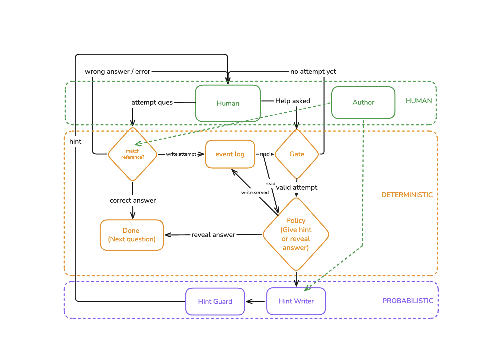
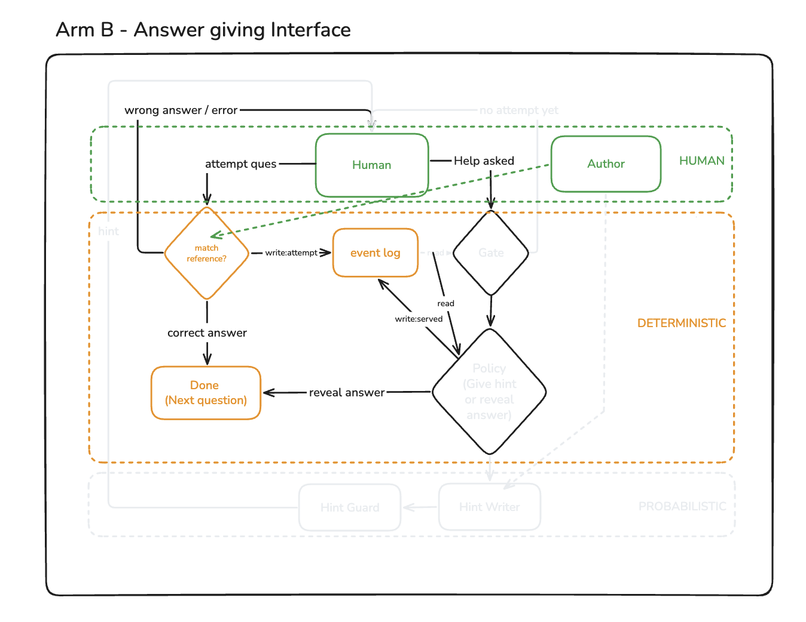

# Learning OS — PRD v1 (scope lock)

Written 10 Sep 2026. Supersedes `PRD-SEED.md`, which described a four-level ladder and a
competence estimator. Both are cut. This is the 6 Sep deliverable, late.

---

## 1. What I am building, in one paragraph

One web app. A learner reads a question in English, writes SQL in an editor, hits Run, and is
told right or wrong. When stuck, they press **Help**. The entire experiment is what Help
returns.

**Both arms use the same app.** Arm A must attempt before Help does anything, and the first
Help is a hint. Arm B gets the answer on demand. That is one boolean in a config. Everything
else — editor, runner, question set, correctness feedback, look and feel — is identical by
design, because if the environments differ I cannot attribute the result to the help policy.

## 2. The hypothesis

If the assistant withholds the answer until the learner has attempted, and gives a hint before
an answer, then unaided performance 5–7 days after the assistant is removed improves against an
answer-giving baseline.

**Mechanism.** Effortful retrieval builds storage strength faster per unit of help given.
Retrieval strength and storage strength are not a see-saw — nothing here *reduces* retrieval
strength; both conditions raise both, in different ratios.

**Narrowed claim (Bastani).** Their answer-giving arm scored *below* no-AI control; their
guardrailed arm merely matched control. My Arm B is their answer-giving arm. So a positive
result reads as **"withholding avoids the damage answer-giving does"**, not "withholding builds
skill." I am making the weaker claim on purpose. I cannot afford a third no-assistant arm at
n=6 and I am not pretending otherwise — see §7.

## 3. Architecture (rubric E3)

The one claim that matters: **the LLM is not in the control path.** It never decides whether to
help or how much. A deterministic policy decides; the LLM only renders the help text once that
decision is made.

Three zones, colour-coded in both diagrams: **human** (green), **deterministic** (orange),
**probabilistic** (purple). Drawn in Excalidraw; sources next to the exports in `diagrams/`.

### Arm A — the tested interface



Follow the two paths out of **Human**. *Attempt a question* runs the query and hits the
correctness check, which either finishes the item or sends the learner back. *Help asked* hits
the **gate** — no executing attempt yet, and the learner is sent back with nothing. Past the
gate, the **policy** decides hint or reveal, and only then does anything reach the purple zone.

Everything the policy reads comes from the event log, and everything it decides is written back
to it. That is what makes the manipulation auditable after the fact.

### Arm B — the answer-giving baseline



**Same diagram, with everything Arm B does not use greyed out.** The gate is grey. The policy is
grey. The hint writer and the leak guard are grey, and so is the whole probabilistic zone. What
is left is: ask for help, get the answer.

This is the clearest statement of §1 in the document. The two arms are **one drawing with
different parts live**, not two systems — one page, one question set, one runner, one log. The
difference between the arms is exactly the difference between these two pictures, which is what
makes a measured difference attributable to the help policy rather than to the environment.

### One box has changed since these were drawn

`match reference?` was literally that on 13 Sep: run the submission, run the reference, compare
the rows. Since 19 Sep it is the frozen scoring rule — the query must also be valid grouped SQL,
and numbers compare to one decimal place. `study-questions/grade_rule.py` and
`app/grade-rule.js` are the two implementations, kept in step by
`evals/grader-conformance.mjs`. `study-questions/DECISIONS.md` sections 3 to 5 have the reasoning.

The shape of the diagram is unaffected: the box sits in the same place and feeds the same two
edges. What changed is what counts as correct inside it.

**Why the split sits there.** The independent variable has to be under my control. If an LLM
judged "this learner seems stuck, give more," Arm A's treatment would vary unpredictably and I
could not state what Arm A received. Deterministic selection makes the manipulation auditable
from the log, which is the only way triage check 1 ("did the arms actually differ?") is
answerable at all. The LLM does the one thing code cannot: write prose about *this* learner's
specific mistake.

## 4. The policy, in full

```
on Help pressed for (learner, item):
    if arm == B:
        serve REVEAL                      # answer-giving baseline, no gate
    if arm == A:
        if no executing attempt logged for this item:
            refuse -> "give it one run first"      # THE GATE
        if help_served_for_item == 0:
            serve HINT
        else if attempts_since_hint >= N:
            serve REVEAL
        else:
            refuse -> "try once more with the hint"
```

That is the whole intervention — see below on what the treatment is and is not. `N` is fixed, not adaptive — the study tests withholding, not
adaptive withholding, and at 3 per arm a varying N would test two variables at once.

**Attempt counting.** Revised 13 Sep after round 2, and again 14 Sep. An attempt counts if:

- it clears the **substance bar** — it contains at least one SQL keyword **and** at least one
  table or column name from the study schema, **and**
- its query text differs from the last counted attempt's, **and**
- it errored, **or** it executed and its result set differs from the last counted attempt's.

**The substance bar, added 14 Sep.** The text clause stops a learner *repeating* junk. It does not
stop three *different* pieces of junk earning a hint while retrieving nothing — Koedinger's
gaming, which his logs say learners find reliably. The bar is deterministic and no model is
involved. Matching is by substring on purpose: round 2 produced `GroupBy` and `havingcount>=3`,
mangled spelling carrying a real mental model, and a token match would discard them. Identifiers
under 4 characters use a word boundary so `id` does not match inside `video`. The schema names are
derived from `SCHEMA` in `app/index.html` at start-up, so a schema change cannot leave the bar
pointing at old tables.

**Validated against all 128 logged round-2 attempts: 121 pass.** The 7 rejected are 6 empty
submissions and one bare `SELECT`. No genuine attempt is lost. Implemented as `isSubstantive()` in
`app/policy.js`; 14 tests in `app/policy.test.js`.

A learner who has typed only junk is told *"write a query against the tables above and run it"*,
which is a different line from *"change something in the query and run it once more"*. The two are
logged distinctly.

Syntax errors are logged as `attempt_type: syntax_error`, never blocked at the UI — blocking
there destroys the data that is itself the measurement. Help requests are logged and never
increment the counter.

The text clause is new. The original rule counted only executing attempts with a new result
set. A query that never executes has no result set, so that rule never fired for a learner who
could not produce one — and it also let a learner earn help by pressing Run on the same query
five times. Evidence: `LEARNING-LOG.md` L11. Implemented in `app/policy.js`, tested in
`app/policy.test.js`.

### What the treatment actually is

Arm A differs from Arm B in **two** ways at once: the gate (must attempt before any help) and
the content of first help (hint, not answer). With three people per arm I cannot separate them —
that would need a third arm (gate + full answers) I cannot afford.

So the treatment is named as a **package**: *require an attempt, then give less than the answer.*
Both changes serve one mechanism — forcing the learner to generate rather than read — so this is
one construct implemented two ways, not two variables carelessly mixed. Bastani's GPT Tutor arm
differed from GPT Base in several ways at once and is reported as a single intervention for the
same reason.

**The limit, stated before anyone asks it:** a positive result supports the policy as a whole.
It does not establish that the gate specifically, or the hint specifically, is what worked. Any
write-up claiming component-level attribution is overclaiming.

**What partial attribution I can still get, for free.** The log records, per item, whether the
learner solved it after being refused help (the gate alone was enough) or only after reading a
hint. Correlational, not causal — but it is exactly the item-level evidence the arm averages
cannot carry at n=3.

### The log writes two entries per Help press, not one — decided 13 Sep

```
help_decided    { action, counted, sinceHelp }        written immediately
help_delivered  { source, modelAttempts, rejections } written after the guard
```

Why two. The policy decides before the hint exists, so a single entry written at decision
time records a choice but reads like an outcome. Two learners — one served a hint about
their own query, one served the canned fallback after two leaks — would produce identical
logs. On 28 Sep they must be countable apart.

Why not one entry filled in later. To write a complete entry the policy would have to wait
for the model to return. That puts the LLM in the control path in the code, whatever §3
says. Two entries keep `decide()` a pure, instant function of the log.

**`decide()` reads only `help_decided`.** So a learner whose hint came back as boilerplate
still climbs the ladder on the normal schedule. The arms must be comparable by policy, not
by whether the model behaved that day. Built in `app/help-session.js`, 20 tests.

**Correctness feedback is NOT withheld** from either arm (Koedinger). Both arms always learn
right/wrong. Only the *help* differs.

**"Unaided", operationally** (the brief's Q1, which it refuses to answer): an item is unaided
if the learner's first executing attempt was correct and no help was served on that item. A
help request marks the item assisted even if a later attempt is correct. This is the knowledge-
tracing definition and it is what the scoring script implements.

## 5. What is already built

*This section described the 10 Sep state and is kept for the record. For what exists today,
`STATUS.md` is the only file allowed to say — it is updated, this one is not.*

The round-2 mini-screen (`screener/round-2-runbutton/sql-mini-screen.html`, 10 Sep) was the thin
vertical slice, minus the help path. It already had: SQLite in the browser, an editor, a Run
button, result-set comparison, error surfacing, per-attempt logging. That was most of §3's
deterministic column.

**All four items in §6 below are now built.** Items 1, 2 and 4 are done and verified; item 3
(log persistence) was deliberately parked in favour of the copy-log button, as §6 item 3 itself
allows.

## 6. What is left to build — four items

1. **Help button + the policy in §4.** Plain code, ~40 lines. This is the graded artefact.
2. **Hint writer.** One LLM call, grounded on the reference query + the learner's query + the
   result diff. Plus the leak guard: reject any hint containing a runnable SELECT or the
   reference query's distinguishing clause. The leak guard is the 18 Sep evals deliverable.
   Built 13 Sep: `app/hint-writer.js` (the prompt and the pinned model),
   `app/hint-guard.js` (the guard), `app/transport.js` +
   `supabase/functions/hint/` (the key never ships in the page). 36 tests.

   **Model pinned: `openai/gpt-oss-120b` at temperature 0.3, on Groq.** A
   production model, not a preview one — the study is six people and one
   session. The Edge Function re-checks the model id server-side, so a tampered
   page cannot silently swap it. Both values are written into `help_delivered`,
   so 28 Sep can prove the writer did not move under the study.

   **One writer, two callers.** `app/index.html` and `evals/replay.js` both
   import `app/hint-writer.js`. A separate eval prompt would mean evaluating one
   thing and shipping another, with the drift invisible.

   **On rejection — decided 13 Sep.** Up to 2 model attempts. If both are rejected, serve the
   question's own hand-written fallback hint. Every attempt and rejection is logged.

   Two consequences, both load-bearing:

   - **`hint_source` must be logged per served hint**, `model` or `fallback`. A canned fallback
     is not the same treatment as a sentence about this learner's own mistake. If a large share
     of Arm A's hints were fallbacks, Arm A received something closer to a generic nudge, and
     the write-up has to say so. The count is a reportable number on 28 Sep, not a footnote.
   - **Every question needs a hand-written fallback hint**, authored with its reference query.
     One global string is either useless or, on a short query, is itself the answer. This is
     part of item 4, and `serveHint` throws without it rather than degrading quietly.

   **The fallback is verified the same way a generation is.** It is the one hint you *know*
   a learner may see, and nothing was checking it. `checkFallback()` runs while authoring —
   must not leak, must name something concrete from the question rather than being advice
   about queries in general, must be short enough to read — and `evals/replay.js` reports
   every question's verdict before the cases. As a last line, `serveHint` inspects the
   fallback too: one that leaks is withheld and the learner gets a neutral line, logged as
   `source: fallback_blocked`. A leaking fallback would convert every model failure into a
   reveal, which is Arm A silently becoming Arm B.

   The gap between a fallback and a generated hint is partly irreducible, and that gap is
   what the LLM is in the system for: the generated hint sees *this* learner's query, the
   fallback can only address the modal mistake. Write fallbacks from the attempt data, not
   from imagination.
3. **Log persistence.** Supabase table. If it threatens 20 Sep, fall back to the copy-log
   button already working in the mini-screen — 6 people pasting a blob is not the bottleneck.

   **Decided 19 Sep: the fallback, on purpose.** The table was not built. The copy and download
   buttons carry `started`, `finished` and now `participant`, so a returned log identifies
   itself. The clause above authorised this trade in advance; it is being taken, not missed.
4. **The question set.** Revised 14 Sep — see `HYPOTHESIS-LOG.md` v0.1. **Frozen 19 Sep:**
   28 items, 16 practice and 12 held-out, in `study-questions/`. Reasons in
   `study-questions/DECISIONS.md`.

   **One concept: GROUP BY/HAVING.** Two-table joins are dead (round 2: 3 of 7 tried, 0
   solved, with an editor). T1 was already out. There is no second concept, and inventing one
   blind is how T3 died.

   **Four sub-skills, three practised, one held back.**

   > **Corrected 19 Sep.** The four definitions below replace the ones written here on 10 Sep.
   > Those said S2 was "choose the right aggregate" and S4 was "order by an aggregate". The
   > question set was authored and frozen against the definitions below, so this document was
   > describing a different experiment from the one that will run. The instrument is
   > authoritative because it is what gets scored; `study-questions/items.py` carries the
   > sub-skill on every item. `LEARNING-LOG.md` L20.

   | | sub-skill | practised? |
   |---|---|---|
   | S1 | group, and one aggregate per group | yes |
   | S2 | filter rows **before** grouping — `WHERE` with `GROUP BY` | yes |
   | S3 | filter groups **after** aggregating — `HAVING` | yes |
   | S4 | compose all three, with `ORDER BY` | **no — the control** |

   S4 is not a fifth thing to learn. It is S2 and S3 in one query, which is why it works as a
   control: a learner who has S2 and S3 separately may or may not combine them, and that is the
   transfer the study is looking for.

   S3 is the modal failure across the 104 logged attempts, so it carries the most weight.

   **Every held-out item is hand-paired to the practice item teaching its sub-skill.** That is
   the σ(p) mapping (`ANALYSIS-PLAN.md` section 2), at sub-skill grain rather than
   concept grain. It is what lets the 28 Sep write-up say the improvement was skill-specific
   rather than "they got comfortable with the editor".

   **The held-out set tests all four, including the unpractised S4.** Improvement on S1–S3
   with S4 flat is the result that rules out familiarity. S4 flat *and* S1–S3 flat is a null.
   S4 rising with the rest means the sub-skills were not separable — assumption 7 in v0.1.

   **Authoring notes.**
   - Budget ~16 practice items: about 5 each on S1, S2, S3. Yield is 1 usable in 3 written,
     and they cannot be screened on the pool without burning participants — so write from the
     104 logged attempts, which say exactly how these seven fail.

     **Outcome, 19 Sep: 16 practice items, but S1 x3, S2 x6, S3 x7 — not 5 each.** Three
     candidate S1 items were cut because round 2 showed an item solved on the first attempt
     produces no ladder decision and so feeds neither arm. The cut was right for the moments
     budget and it leaves S1 measured on thinner practice than S3, which is recorded as a known
     weakness rather than smoothed over. `study-questions/DECISIONS.md` section 1,
     `HYPOTHESIS-LOG.md` v1 assumption 6.
   - Frozen before the policy is tuned, so it cannot be tuned to.
   - **Both screening rounds' questions are burned**, and the study needs a different schema
     as well.
   - Each question needs its own hand-written fallback hint, verified with `checkFallback()`
     — see item 2.
   - Pick S4 so it is not at the floor for everyone. If nobody can do it before or after,
     the contrast proves nothing (v0.1 assumption 5).

## 7. Cut list — deliberately not built, and why

| cut | why |
|---|---|
| Competence estimator / BKT | Needs many observations per skill to converge. At n=6 with a short question set it is noise dressed as a model. Stays as a roadmap claim. |
| Four-level ladder (nudge, partial scaffold) | With a gate in front, the nudge is redundant — the gate already forces the unaided attempt. Partial scaffold gives too much help for the storage strength it buys. Two levels. |
| Adaptive N | Tests a second variable the sample cannot resolve. |
| Third no-assistant arm | Cannot afford it at n=6. Named openly in §2; the claim is narrowed to match. Choosing not to, and defending it, is a decision (rule C). |
| Re-queue of unmastered concepts | Would give Arm A extra practice reps Arm B does not get. A confound. Keep the flag, drop the behaviour. |
| Free-text self-explanation, help-seeking scaffolding | Paper TODOs, not on the critical path. |
| Auth, profiles, any UI beyond one screen | E4 is "works for someone not on your team", not "looks like a product." |

## 8. The ~24 paper TODOs, sorted

- **Policy spec (~10, mostly Koedinger)** — §4 above. Done in this document.
- **Measurement pre-commitments (~7)** — must be fixed before data exists. §9 below. **Open.**
- **Framing and rebuttals (~8)** — write-up material, change no code. Defer to freeze week.
- **Cuts (2)** — §7.

Only the first two are on the September critical path. The framing bucket must not compete
with the build.

## 9. Still open — decisions I owe before data exists

1. ~~**N**~~ **Closed 13 Sep: N = 2.** It is a constant in `app/policy.js` and a one-line
   change. Fixed, never adaptive.
2. ~~**The four §4 null-result thresholds**~~ **Closed 14 Sep.** Filled in
   `ANALYSIS-PLAN.md` section 4, with two new checks in front of them — attrition (0a) and
   actual elapsed gap (0b). The old check 1 was replaced: its denominator was about 23 events
   across Arm A, so a percentage could not be computed. Committed before any Arm B data exists.
3. ~~**Does a syntax error satisfy the gate?**~~ **Closed 13 Sep: yes. Mechanism added 14 Sep.**

   The 13 Sep reason was volume: round 2 produced no working query in 5 of 21 person-questions,
   and 101 of 122 attempts failed to parse. Without this the study runs on 21 attempts and the
   arms do not differ. True, but a volume argument alone is choosing the rule that yields more
   data, which is the thing §9 item 2 exists to prevent.

   **The mechanism.** Kornell, Hays & Bjork: a *failed* generation attempt still teaches. Their
   participants guessed wrong on nearly every weakly-related word pair and still learned more
   than people who studied the pair intact. The value is in the reach, not the landing. A query
   that will not parse can carry a complete, wrong mental model — `SELECT customer_id, COUNT(*)
   FROM orders WHERE COUNT(*) > 3` does not run and is a textbook S3 error. **Parsing is a
   property of the SQL grammar. Retrieval is a property of the learner.** The gate must test the
   second.

   There is a fairness argument too. Requiring an executing query locks out the weakest learners
   — rishabh executed nothing on 3 of 3 round-2 questions and would never have received help.
   The gate would fail the person it exists to serve.

   **What this leaves open, and how §4 closes it.** `asdf` does not parse either. The substance
   bar in §4 is what separates a wrong query from a non-query.

## 10. Counter-metrics

Stated preference (satisfaction) is **not** a falsifier — the literature predicts Arm A reports
the tool was worse while scoring higher. Revealed behaviour (unfinished session, no-show at the
removal test) **is**. Differential attrition by arm is the main threat to the study, not the
counter-metric; report `completed_removal_test` per person, by arm.

Wu's motivation cost lands on the arm that *had* full answers and lost them — that is Arm B on
removal day, not Arm A. Three Likert items on removal-test day, near-zero build cost.
